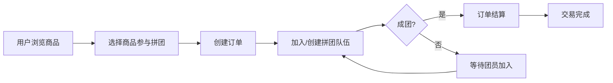

# 🛒 Group Buy Market - 拼团电商平台

<p align="center">
  <strong>基于 DDD 架构的拼团电商系统，支持多种优惠策略、营销管理与实时数据处理</strong>
</p>

<p align="center">
  <a href="http://134.175.232.110/"><strong>🎬 在线演示</strong></a>
  ·
  <a href="#项目介绍"><strong>项目介绍</strong></a>
  ·
  <a href="#技术架构"><strong>技术架构</strong></a>
  ·
  <a href="#模块介绍"><strong>模块介绍</strong></a>
  ·
  <a href="#功能特性"><strong>功能特性</strong></a>
  ·
  <a href="#快速开始"><strong>快速开始</strong></a>
</p>

---

## 📖 项目介绍

**Group Buy Market** 是一个基于 Spring Boot 的企业级拼团电商平台，采用领域驱动设计（DDD）架构思想，实现了完整的拼团交易链路。系统支持多种优惠策略（打折、直减、满减等），提供完善的营销管理后台，并通过 Kafka 消息队列处理异步事件，具备良好的可扩展性与高可用性。

### 核心业务流程



---

## 🎬 在线演示

> **演示地址：[http://134.175.232.110/](http://134.175.232.110/)**

| 端 | 地址 | 说明 |
|---|---|---|
| 🏪 用户端 | [http://134.175.232.110/](http://134.175.232.110/) | 商品浏览、拼团下单 |
| 📊 营销后台 | [http://134.175.232.110/marketing.html](http://134.175.232.110/marketing.html) | 活动管理、数据统计 |
| 🛠️ Kafka UI | [http://134.175.232.110:8082/](http://134.175.232.110:8082/) | Kafka 集群监控 |
| 🗄️ Redis Admin | [http://134.175.232.110:8081/](http://134.175.232.110:8081/) | Redis 可视化管理 |
| 🗄️ phpMyAdmin | [http://134.175.232.110:8899/](http://134.175.232.110:8899/) | 数据库管理 |

---

## 🏗️ 技术架构

### 技术栈

| 分类 | 技术 | 版本 |
|---|---|---|
| 语言 | Java | 17 |
| 框架 | Spring Boot | 2.7.12 |
| ORM | MyBatis Plus | 3.5.7 |
| 数据库 | MySQL | 8.0 |
| 缓存 | Redis + Redisson | 6.2 / 3.26.0 |
| 消息队列 | Kafka (KRaft模式) | 4.0 |
| Web服务器 | Nginx | 1.25.1 |
| 工具库 | Hutool、Guava、Fastjson | - |
| 鉴权 | JWT (jjwt + java-jwt) | - |
| 容器化 | Docker Compose | - |

### 分层架构

```
┌─────────────────────────────────────────────────┐
│                  Trigger Layer                    │
│        HTTP Controller / Job / Listener           │
├─────────────────────────────────────────────────┤
│                    API Layer                      │
│           DTO / API Interface / Response          │
├─────────────────────────────────────────────────┤
│                  Domain Layer                     │
│     Trade / Activity / Tag (Entity/Aggregate/     │
│            ValueObject/Service)                   │
├─────────────────────────────────────────────────┤
│              Infrastructure Layer                 │
│     DAO / Cache / MQ / Gateway / Auth / DCC       │
├─────────────────────────────────────────────────┤
│                  Types Layer                      │
│        Enums / Exception / Utils / Design         │
├─────────────────────────────────────────────────┤
│                  Rate Limiter                     │
│            Annotation / AOP / Config              │
└─────────────────────────────────────────────────┘
```

---

## 📦 模块介绍

### group-buy-market-types（基础类型层）

公共类型定义模块，为所有其他模块提供基础支撑：

- **枚举定义** — 活动类型、优惠类型、订单状态、响应码等枚举
- **异常体系** — 统一业务异常 `AppException`，支持错误码传递
- **工具类** — Redis 幂等校验器、JUC 并发工具
- **设计模式** — 规则树（Rule Tree）抽象框架，用于订单优惠策略计算
- **事件定义** — 领域事件基类与类型定义
- **注解** — 自定义注解定义

### group-buy-market-domain（领域层）

DDD 核心业务逻辑层，按业务域组织：

**交易域（Trade）**

| 服务 | 说明 |
|---|---|
| `creatOrder` | **订单创建服务** — 内置规则树引擎，支持多种优惠计算策略：打折、直减、满减、拼团优惠等 |
| `lifecycle` | **订单生命周期服务** — 订单状态流转：创建 → 支付/待成团 → 结算/取消 |
| `preCheck` | **前置校验服务** — 库存校验、活动校验、用户资格校验、幂等校验 |
| `marketing` | **营销查询服务** — 活动总览、销售统计、商品排行、Dashboard数据 |
| `activityManage` | **活动管理服务** — 活动创建/更新/撤销、拼团队伍管理 |
| `productQuery` | **商品查询服务** — 商品列表、商品详情查询 |
| `userQuery` | **用户查询服务** — 用户订单列表、订单详情查询 |

**活动域（Activity）** — 活动配置聚合、活动商品关联

**标签域（Tag）** — 用户标签记录与管理

### group-buy-market-api（API 接口层）

定义对外接口协议，包括：

- **DTO 对象** — 请求/响应数据传输对象（商品、订单、活动、营销等 30+ 个 DTO）
- **API 接口** — 声明式 Feign 风格接口（`ITradeController`、`IMarketingController` 等）
- **统一响应** — `Response<T>` 统一响应格式封装

### group-buy-market-trigger（触发器层）

对外暴露的接入层：

| 控制器 | 路径 | 说明 |
|---|---|---|
| `TradeController` | `/api/v1/trade/**` | 交易接口：创建订单、订单结算、订单取消 |
| `ProductController` | `/api/v1/product/**` | 商品接口：商品列表、商品详情 |
| `UserController` | `/api/v1/user/**` | 用户接口：订单列表、订单详情 |
| `MarketingController` | `/api/v1/marketing/**` | 营销后台：登录、活动管理、销售数据、Dashboard |
| `AiController` | `/api/v1/ai/**` | AI 查询接口：为 AI Agent 提供实时商城数据 |
| `DCCController` | - | 动态配置中心（DCC）接口 |

**定时任务：**
- `TimeoutTaskScanner` — 超时订单/拼团扫描处理
- `MqTaskDispatcher` — MQ 任务分发调度

### group-buy-market-infrastructure（基础设施层）

提供技术基础支撑：

| 组件 | 说明 |
|---|---|
| **DAO / PO** | MyBatis Plus 数据访问层，含 10+ 个持久化对象（订单、SKU、活动、拼团队伍等） |
| **Cache** | Redis 缓存服务，缓存商品、活动等热点数据 |
| **MQ / Kafka** | 消息队列，含生产者 `MqProducer` 和消费者（订单超时、拼团超时、库存耗尽、缓存刷新、活动订单超时处理） |
| **Gateway** | 外部服务网关（物流、支付等） |
| **Auth** | JWT 营销后台登录鉴权 |
| **DCC** | 动态配置中心（Dynamic Config Center） |
| **Port** | 端口适配器，实现领域层定义的仓储接口 |

### group-buy-market-app（应用启动层）

Spring Boot 应用入口与配置：

- **`Application.java`** — 启动类，启用定时任务
- **配置类** — Redis、Kafka、Guava Cache、线程池、Jackson、WebMvc、DCC 等配置

### rate-limiter（限流器模块）

基于 AOP 的自定义限流组件：

- `@AccessRateLimit` — 声明式限流注解，支持按 key（如 userId）限流
- 可配置 QPS、阻塞阈值、降级回调方法
- Redis + Lua 脚本实现滑动窗口限流算法

---

## ✨ 功能特性

### 用户端

- ✅ **商品浏览** — 商品列表分页查询、商品详情查看
- ✅ **拼团下单** — 支持加入已有拼团队伍或新建队伍
- ✅ **订单管理** — 订单创建、支付、取消、历史查询
- ✅ **拼团进度** — 实时查看拼团进度与队伍状态

### 营销后台

- ✅ **活动管理** — 创建/编辑/撤销营销活动，配置优惠策略
- ✅ **活动总览** — 多活动维度数据：队伍数、参与人数、成团率、结算率
- ✅ **拼团详情** — 查看活动下所有拼团队伍及成员信息
- ✅ **销售统计** — 今日/昨日销售数据概览
- ✅ **商品排行** — Top-N 商品销量与销售额排行
- ✅ **Dashboard** — 首页数据看板：营收、活跃活动、热销商品

### AI 赋能

- ✅ **AI 数据查询接口** — 专为 AI Agent 设计，提供结构化的商品、订单、活动实时数据，便于 AI 驱动的智能客服与数据分析场景

### 技术亮点

- ✅ **规则树引擎** — 可扩展的优惠计算规则树，支持节点热插拔（打折/直减/满减/拼团）
- ✅ **Kafka 消息驱动** — 订单超时自动取消、拼团超时自动解散、库存恢复等异步事件处理
- ✅ **Redis 幂等校验** — 基于 Redis 的订单创建幂等性保证，防止重复下单
- ✅ **自定义限流器** — AOP 注解式限流，支持用户级 QPS 控制与降级回调
- ✅ **DDD 架构** — 清晰的领域边界与分层，易于维护与扩展
- ✅ **动态配置** — 活动配置热更新，无需重启服务

---

## 🚀 快速开始

### 环境要求

- JDK 17+
- Maven 3.6+
- Docker & Docker Compose

### 1. 克隆项目

```bash
git clone https://github.com/fuzhengwei/group-buy-market.git
cd group-buy-market-better
```

### 2. 启动中间件（Docker Compose）

```bash
# 启动 MySQL、Redis、Kafka 等基础环境
cd docs/dev-ops
docker-compose -f docker-compose-env.yml up -d
```

中间件端口映射：

| 服务 | 端口 | 管理工具 |
|---|---|---|
| MySQL | 13306 | phpMyAdmin → `:8899` |
| Redis | 16379 | Redis Commander → `:8081` |
| Kafka | 19092 | Kafka UI → `:8082` |

### 3. 初始化数据库

使用 `docs/dev-ops/mysql/group_buy_market_better.sql` 文件初始化数据库结构。

### 4. 启动应用

```bash
# 在项目根目录执行
mvn clean install -DskipTests
cd group-buy-market-app
mvn spring-boot:run -Pdev
```

### 5. 启动前端（Nginx）

```bash
# 在前一步的 docs/dev-ops 目录下
docker-compose -f docker-compose-app.yml up -d
```

### 6. 访问系统

- 用户端：http://localhost/
- 营销后台：http://localhost/marketing.html

---

## 📂 项目目录

```
group-buy-market-better/
├── group-buy-market-api/            # API 接口层 - DTO、接口定义
├── group-buy-market-app/            # 应用启动层 - 入口、配置
├── group-buy-market-domain/         # 领域层 - 核心业务逻辑
│   ├── activity/                    #   活动域
│   ├── tag/                         #   标签域
│   └── trade/                       #   交易域
├── group-buy-market-infrastructure/ # 基础设施层 - DAO、缓存、MQ
├── group-buy-market-trigger/        # 触发器层 - HTTP、Job、Listener
├── group-buy-market-types/          # 基础类型层 - 枚举、异常、工具
├── rate-limiter/                    # 限流器模块
├── docs/
│   └── dev-ops/                     # 部署配置
│       ├── docker-compose-env.yml   #   中间件编排
│       ├── docker-compose-app.yml   #   应用编排
│       ├── nginx/                   #   Nginx 配置 & 前端页面
│       ├── mysql/                   #   数据库初始化脚本
│       └── redis/                   #   Redis 配置
└── pom.xml                          # Maven 父 POM
```

---

## 🤝 贡献

项目作者：**xiaofuge**（[fuzhengwei](https://github.com/fuzhengwei)）

欢迎提交 Issue 和 Pull Request！

---

## 📄 许可证

本项目基于 [Apache License 2.0](https://www.apache.org/licenses/LICENSE-2.0) 开源。
